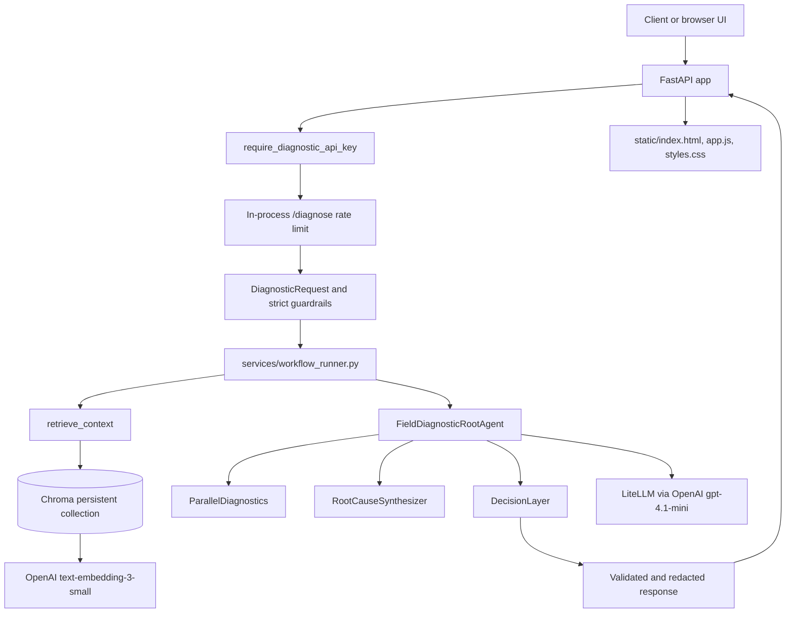
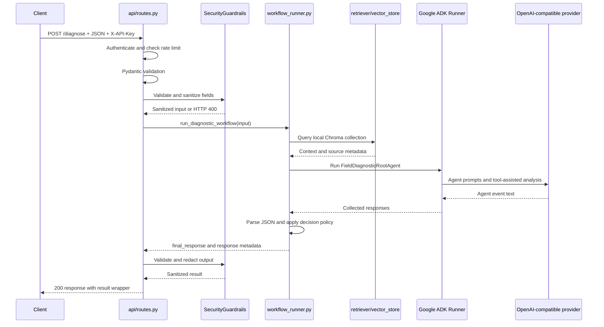
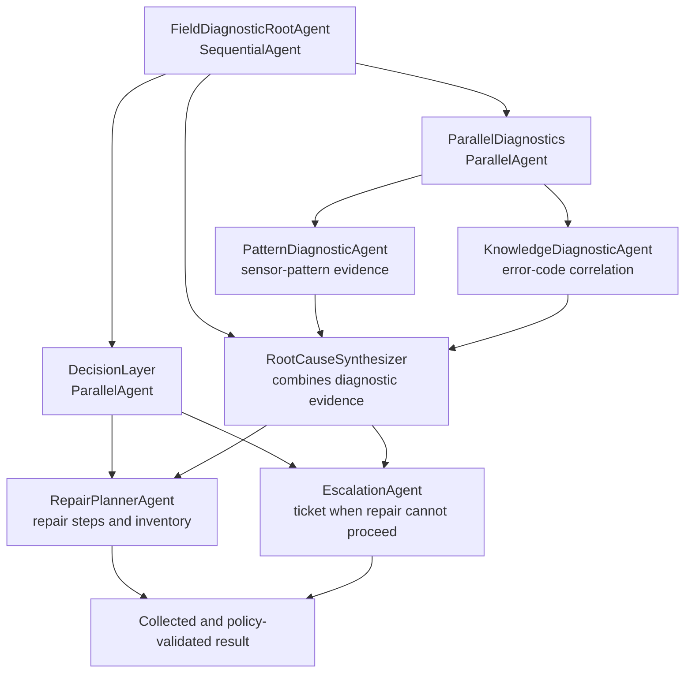
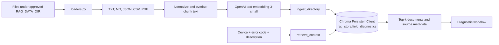

# AI Field Diagnostic

AI Field Diagnostic is a FastAPI application for analyzing equipment failures. A client sends a device, error code, and symptom description. The application validates the request, retrieves relevant text from a local Chroma vector store, runs a Google ADK multi-agent workflow backed by `openai/gpt-4.1-mini`, and returns a structured diagnostic result.

The project includes a browser UI at `/`, a custom Swagger interface at `/api-reference`, and one diagnostic API operation: `POST /diagnose`.

## 1. What This Project Does

The system combines two kinds of evidence:

- **RAG (retrieval-augmented generation):** searches locally indexed manuals, logs, tickets, and other supported documents for relevant context.
- **Multiple agents:** separate agents analyze patterns, correlate error codes, synthesize a root cause, plan repairs, check parts, and decide whether escalation is needed.

```text
Client
   |
   v
FastAPI route
   |
   v
API-key authentication and rate limit
   |
   v
Pydantic validation and strict input guardrails
   |
   +--> Local Chroma retrieval (retried; can degrade)
   |
   v
Google ADK agent workflow
   |
   v
JSON merge, confidence/parts policy, and output redaction
   |
   v
{"result": {"final_response": {...}, "responses": [...]}}
```

## 2. Key Features

- FastAPI API with Pydantic request and response models
- `X-API-Key` authentication for `/diagnose`
- In-process sliding-window rate limiting
- Strict input validation and prompt-injection detection
- Local RAG with ChromaDB and OpenAI embeddings
- Google ADK sequential and parallel agent orchestration
- Inventory lookup and deterministic service-ticket tools
- Confidence-based follow-up and escalation policy
- Provider retry, timeout classification, and safe error messages
- Graceful RAG degradation when retrieval fails
- Output redaction for common sensitive-looking values
- Browser UI and custom Swagger UI
- Automated tests

## 3. System Architecture



`run.py` starts Uvicorn with `app.main:app` on port `8000` in reload mode.

## 4. End-to-End Request Flow



Authentication runs before the route body. Missing or invalid credentials return `401`; malformed request fields return `422`; guardrail rejection returns `400`; workflow exceptions return `500`.

## 5. Project Structure

```text
AI_FIELD_DIAGNOSTIC/
├── api/routes.py                         # /diagnose, auth, rate limit, schemas
├── app/
│   ├── main.py                           # FastAPI app, UI, API reference routes
│   ├── models.py                         # Provider key, model, timeout settings
│   ├── agents/                           # Google ADK agent graph
│   │   ├── root_agent.py                 # Sequential root and decision layer
│   │   ├── parallel_diagnostics.py       # Parallel diagnostic branch
│   │   ├── diagnostic/                   # Pattern and knowledge agents
│   │   ├── synthesis/                    # Root-cause synthesizer
│   │   └── decision/                     # Repair planner and escalation agents
│   ├── rag/                              # Load, chunk, embed, store, retrieve
│   ├── security/                         # Input/output and tool guardrails
│   └── tools/                            # Sensor, inventory, and ticket tools
├── agents/field_diagnostic/agent.py      # ADK entrypoint wrapper
├── services/workflow_runner.py           # RAG + ADK execution and policy
├── static/                               # Browser diagnostic UI assets
├── rag_store/                            # Persistent Chroma database directory
├── tests/                                # API, security, RAG, and policy tests
├── run.py                                # Local Uvicorn entry point
├── requirements.txt                      # Python dependencies
├── .env.example                          # Environment variable template
├── pytest.ini                            # Pytest discovery and import path
└── .gitignore                             # Ignores secrets and runtime artifacts
```

## 6. How the Diagnostic Workflow Works

1. **Request:** the client sends `device`, `error_code`, and `description`.
2. **Authentication and validation:** the API checks `X-API-Key`, applies the rate limit, validates the Pydantic model, and runs strict input guardrails. Device names are limited to 80 characters, error codes to 40, and descriptions to 1,000.
3. **Context retrieval:** the workflow queries Chroma using all three request fields. Retrieved text and source metadata are passed to agents as explicitly untrusted reference data.
4. **Agent execution:** an in-memory ADK session runs the root agent and collects text from emitted events. Agents are expected to return JSON objects.
5. **Decision policy:** valid objects are merged; inventory is normalized and checked; follow-up questions are added below confidence `0.65`; escalation is marked below `0.40`, for unavailable required parts, or for an explicit escalation decision.
6. **Response:** the API validates the result wrapper, recursively redacts sensitive-looking values, and returns it.

## 7. Multi-Agent Architecture



| Agent | Responsibility |
| --- | --- |
| `PatternDiagnosticAgent` | Calls `get_sensor_context(device, error_code)` and identifies a likely failure pattern from its output. |
| `KnowledgeDiagnosticAgent` | Correlates the error code with known failures and reports low confidence for missing or unknown codes. |
| `RootCauseSynthesizer` | Combines pattern and knowledge analyses into root cause, recommended part, confidence, rationale, contradictions, and follow-ups. |
| `RepairPlannerAgent` | Produces repair steps and required parts; it must check inventory before recommending replacement. |
| `EscalationAgent` | Decides when repair cannot proceed and calls `create_service_ticket` when escalation is needed. |

All five LLM agents use `openai/gpt-4.1-mini` through ADK's `LiteLlm`, with temperature `0.4` and the configured provider timeout.

## 8. RAG Pipeline



Place supported files below the approved root and run:

```powershell
.\.venv\Scripts\python -m app.rag.ingest
```

The default ingestion root is `app/rag_data`; `RAG_DATA_DIR` overrides it. The checked-in `rag_store/` is the Chroma persistence directory, not a source-document directory. Ingestion uses 1,000-character chunks with 200-character overlap by default and stores source path and detected source type metadata.

## 9. RAG Security

- The ingestion root must exist and be a directory.
- The resolved requested path must be inside the approved `RAG_DATA_DIR`.
- Symlinks are rejected.
- Only `.txt`, `.md`, `.json`, `.csv`, and `.pdf` files are read.
- Resolved files must remain within the approved root.

## 10. API

| Method | Endpoint | Purpose | Authentication |
| --- | --- | --- | --- |
| `POST` | `/diagnose` | Run the diagnostic workflow | `X-API-Key` required |
| `GET` | `/` | Serve the browser UI | None |
| `GET` | `/api-reference` | Serve custom Swagger UI | None |
| `GET` | `/openapi.json` | FastAPI-generated OpenAPI document | None |
| `GET` | `/static/...` | Serve frontend assets | None |

### Request

```json
{
   "device": "HVAC-2000X",
   "error_code": "E-HEAT",
   "description": "The device overheats after ten minutes and the cooling fan vibrates."
}
```

All three fields are required non-empty strings. The request model limits them to 80, 40, and 1,000 characters. Guardrails apply additional character and prompt-injection checks.

### Response

The outer response is shaped as:

```json
{
   "result": {
      "final_response": {
         "root_cause": "cooling fan failure",
         "recommended_part": "Cooling fan",
         "confidence": 0.81,
         "rationale": "Sensor pattern and retrieved evidence support a cooling failure.",
         "required_parts": ["Cooling fan"],
         "inventory": {"Cooling fan": 5},
         "follow_ups": [],
         "missing_parts": [],
         "needs_follow_up": false,
         "escalation_needed": false,
         "proceed": true
      },
      "responses": ["<agent JSON responses>"]
   }
}
```

`final_response` varies with agent output and may also include `steps`, `notes`, `ticket`, `rag`, or validation metadata. Provider/configuration failures return controlled `error` and `message` fields instead.

## 11. Authentication

Set `DIAGNOSTIC_API_KEY` in `.env` and send the same value in:

```text
X-API-Key: your-local-diagnostic-key
```

If the environment variable is missing, the header is missing, or the value does not match, the endpoint returns `401` with `{"detail":"Authentication required"}`.

## 12. Rate Limiting

The API uses an in-process sliding window for `/diagnose`. Defaults are 30 requests per 60 seconds. When exceeded, the endpoint returns `429` with a `Retry-After` header. The state is per process and resets when the process restarts.

## 13. Error Handling

| Situation | Behavior |
| --- | --- |
| Missing or invalid API key | `401 Authentication required` |
| Invalid JSON fields or missing fields | FastAPI `422` validation response |
| Strict guardrail rejection | `400 Input validation failed` |
| Rate limit exceeded | `429` with `Retry-After` |
| RAG retrieval failure | Retried, then workflow continues without context and adds `rag_unavailable` to the final response |
| Provider timeout | Retried, then returns `error: "llm_timeout"` |
| Provider connection/API failure | Retried, then returns `error: "llm_provider_error"` |
| Missing model configuration | Returns `error: "dependency_unavailable"` without exposing the key or raw exception |
| All agent responses malformed | Returns `error: "malformed_agent_output"` and validation metadata |
| Unexpected workflow exception | `500 Diagnostic workflow failed` |
| Sensitive-looking output values | Redacted before the response is returned |

Agent attempts default to two tries with `0.6` second incremental backoff. RAG attempts default to two tries with `0.4` second incremental backoff.

## 14. Environment Variables

### Required for a live diagnostic

| Variable | Purpose | Example |
| --- | --- | --- |
| `OPENAI_KEY` | Key for LLM and embedding clients | `replace_with_openai_key` |
| `DIAGNOSTIC_API_KEY` | Key required by `/diagnose` | `local-secret` |

### Optional settings

| Variable | Default | Purpose |
| --- | ---: | --- |
| `DIAGNOSTIC_TIMEOUT_SECONDS` | `20` | LLM and embedding timeout; `OPENAI_TIMEOUT_SECONDS` is a legacy fallback. |
| `DIAGNOSTIC_RATE_LIMIT_WINDOW_SECONDS` | `60` | API rate-limit window. |
| `DIAGNOSTIC_RATE_LIMIT_MAX_REQUESTS` | `30` | Maximum requests in that window. |
| `RAG_DATA_DIR` | `app/rag_data` | Approved source-document root. |
| `RAG_STORE_DIR` | `rag_store` | Chroma persistence directory. |
| `RAG_COLLECTION` | `field_diagnostics` | Chroma collection name. |
| `RAG_QUERY_INCLUDE` | `documents,metadatas` | Chroma result fields requested. |
| `RAG_EMBED_MODEL` | `text-embedding-3-small` | Embedding model. |
| `RAG_TOP_K` | `4` | Records requested by retrieval. |
| `RAG_CHUNK_SIZE` | `1000` | Chunk size in characters. |
| `RAG_CHUNK_OVERLAP` | `200` | Chunk overlap in characters. |
| `DIAG_MAX_ATTEMPTS` | `2` | Agent attempts. |
| `DIAG_RETRY_BACKOFF_SECONDS` | `0.6` | Agent retry delay. |
| `RAG_MAX_ATTEMPTS` | `2` | RAG attempts. |
| `RAG_RETRY_BACKOFF_SECONDS` | `0.4` | RAG retry delay. |
| `ENABLE_KEYWORD_REQUIRED_PARTS` | `true` | Infer parts when agents omit them. |
| `ENABLE_ERROR_CODE_MAPPING` | `true` | Enable the inventory tool's error-code mapping table. |

## 15. Local Setup

```powershell
git clone <repository-url>
cd AI_FIELD_DIAGNOSTIC
python -m venv .venv
.\.venv\Scripts\Activate.ps1
python -m pip install -r requirements.txt
Copy-Item .env.example .env
```

Set a real `OPENAI_KEY` for live model and embedding calls and a private local value for `DIAGNOSTIC_API_KEY`. The template points `RAG_DATA_DIR` at `./rag_store`; use a separate source-document directory when possible.

Start the development server:

```powershell
python run.py
```

It listens on `http://localhost:8000`. Use `/` for the UI or `/api-reference` for Swagger UI.

## 16. How to Test

```powershell
python -m pytest -q
```

The tests cover API success and validation, authentication, rate limiting, prompt-injection detection, sanitization, tool limits, output redaction, RAG root handling, untrusted context, agent JSON validation, confidence policy, provider failures, timeout classification, RAG degradation, and safe frontend rendering. Live provider calls are mocked or bypassed where needed, so a live OpenAI key is not required.

## 17. Example Usage

```powershell
$headers = @{
      "Content-Type" = "application/json"
      "X-API-Key" = "your-local-diagnostic-key"
}
$body = @{
      device = "HVAC-2000X"
      error_code = "E-HEAT"
      description = "The device overheats after ten minutes and the cooling fan vibrates."
} | ConvertTo-Json

Invoke-RestMethod -Method Post -Uri "http://localhost:8000/diagnose" -Headers $headers -Body $body
```

## 18. Development Workflow

1. Create and activate `.venv`.
2. Install `requirements.txt`.
3. Copy and configure `.env`.
4. Run `python -m pytest -q`.
5. Start the server with `python run.py`.
6. Make a focused change and run the tests again.

## 19. Security Notes

- Keep `.env` and provider keys out of Git.
- Input guardrails reject suspicious prompt-injection patterns and unsafe field values.
- RAG ingestion enforces the approved root, resolved paths, supported extensions, and symlink restrictions.
- Retrieved RAG text is labeled untrusted reference data in the agent message.
- Tool names, parameters, and per-session/per-minute tool usage are checked.
- Agent output is checked for expected structure and dangerous strings.
- Responses redact common emails, SSNs, credit-card-like numbers, and key/password/token assignments.
- Provider exceptions are classified into safe messages rather than returned verbatim.

## 20. Troubleshooting

### Virtual environment or dependencies are missing

Run `python -m venv .venv`, then `python -m pip install -r requirements.txt`.

### Authentication returns `401`

Check `DIAGNOSTIC_API_KEY`, restart the server after changing `.env`, and send the matching `X-API-Key` header. The current browser form does not add this header, so direct form submissions currently receive `401`.

### Port `8000` is already in use

`run.py` uses port `8000`. Stop the process using it, or run another port directly:

```powershell
python -m uvicorn app.main:app --port 8001 --reload
```

### RAG documents do not load

Check `RAG_DATA_DIR`, make sure it exists, and place supported files below it. Do not use paths outside the approved root or symlinks. The default code root is `app/rag_data`; the example `.env` overrides it to `./rag_store`.

### Model or embeddings fail

Check `OPENAI_KEY` and `DIAGNOSTIC_TIMEOUT_SECONDS`. RAG retrieval is retried and can be marked unavailable while agents continue. Provider failures are retried and then returned as controlled `llm_timeout`, `llm_provider_error`, or `dependency_unavailable` results.

## 21. Technology Stack

| Technology | Use |
| --- | --- |
| Python | Application language |
| FastAPI | HTTP API and OpenAPI generation |
| Uvicorn | ASGI server |
| Pydantic | Request and response validation |
| Google ADK | Agent definitions, sessions, and runner |
| LiteLLM | OpenAI-compatible model adapter |
| OpenAI Python client | Embedding requests |
| ChromaDB | Persistent vector store and similarity queries |
| pypdf | PDF text extraction |
| python-dotenv | `.env` loading |
| Pytest | Automated tests |
| HTML, CSS, JavaScript | Browser UI |

## 22. Architecture at a Glance

```mermaid
flowchart TD
      A[Client] --> B[FastAPI: POST /diagnose]
      B --> C[API key + in-process rate limit]
      C --> D[Pydantic + strict security guardrails]
      D --> E[Retrieve top-k local Chroma context]
      E --> F[ADK root agent]
      F --> G[Parallel pattern and knowledge analysis]
      G --> H[Root-cause synthesis]
      H --> I[Parallel repair planning and escalation]
      I --> J[JSON validation + confidence/parts policy]
      J --> K[Sensitive-value redaction]
      K --> L[Response: {result: ...}]
```

> **Known product gap:** the static browser form sends the diagnostic JSON body but does not send `X-API-Key`. Because `/diagnose` requires that header, direct form submissions currently receive `401`. This README documents the behavior; it does not change application code.

## License

This project is distributed under the MIT License. See [LICENSE](LICENSE).
